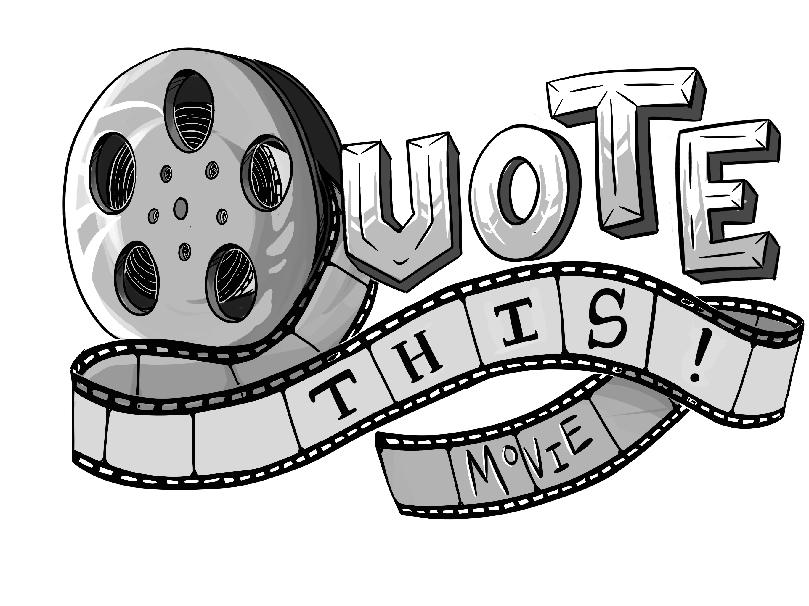
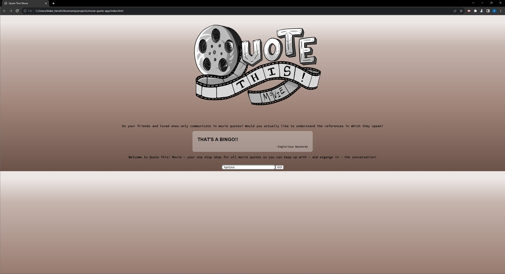
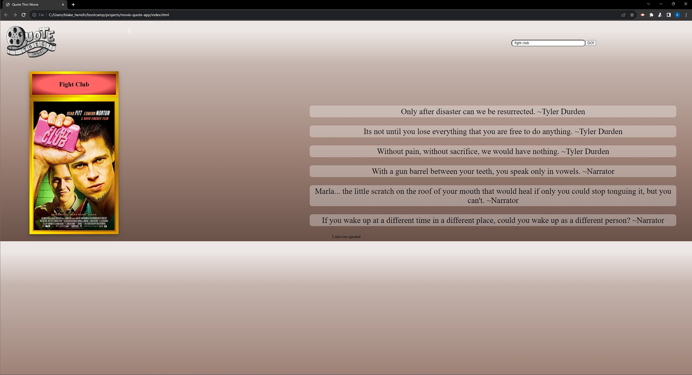

# Quote This! Movie

## Description 
This web appliction ables the user to search for any movie and get multiple popular quotes back along with then character that said it and a poster image for the movie. Our team acheived this by using HTML, CSS, and JavaScript along with two API's stated in the credits.

## Deployed Link
 [Quote This! Movie](https://blakewb3.github.io/Quote-This-Movie/)

## Table of Contents
* [Description](#description) 
* [Deployed link](#deployed-link)
* [How to use](#how-to-use) 
* [API's used](#apis-used)
* [Contributors](#contributors)
* [License](#license) 

## How to use
### Step 1. Click on site link - [Quote This! Movie](https://blakewb3.github.io/Quote-This-Movie/)
    

### Step 2. Type any movie you want to know some famous quotes from in the search bar
    

### Step 3. Either click "Go!" or press enter and you will receive a poster for the movie, along with some popular quotes and characters who said them.
    

### Step 4. Enjoy!

## API's used 
* [Movie and TV shows Quotes](https://rapidapi.com/rur209-fl23Nrvhxii/api/movie-and-tv-shows-quotes)
* [Poster API](https://www.omdbapi.com/)

## Contributors
Luke Phillips - Project manajor and JavaScript 
 &nbsp;&nbsp;&nbsp;&nbsp;&nbsp;&nbsp;&nbsp;&nbsp;&nbsp;[Luke's Github](https://github.com/lukeinco)
 Alaina York - CSS and creative styling 
 &nbsp;&nbsp;&nbsp;&nbsp;&nbsp;&nbsp;&nbsp;&nbsp;&nbsp;[Alaina's Github](https://github.com/Ayorkster)
 Paige Stoyle - HTML starter, API researcher, and presentation narrator 
 &nbsp;&nbsp;&nbsp;&nbsp;&nbsp;&nbsp;&nbsp;&nbsp;&nbsp;[Paige's Github](https://github.com/pcstoyle)
 Blake Wallace - README, Gitbhub repo holder, and API researcher
 &nbsp;&nbsp;&nbsp;&nbsp;&nbsp;&nbsp;&nbsp;&nbsp;&nbsp;[Blake's Github](https://github.com/Blakewb3)

## License
[MIT Licene](./LICENSE)

  

